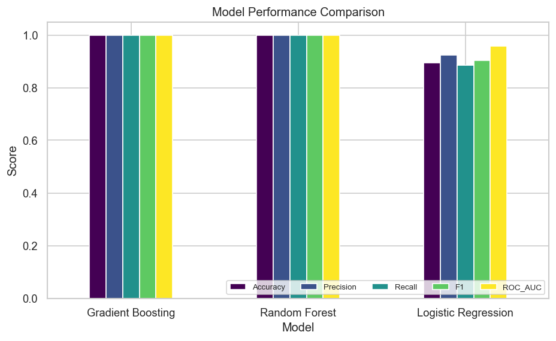
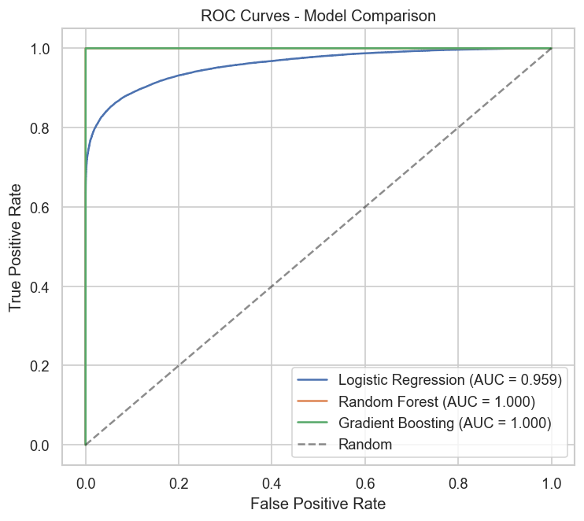
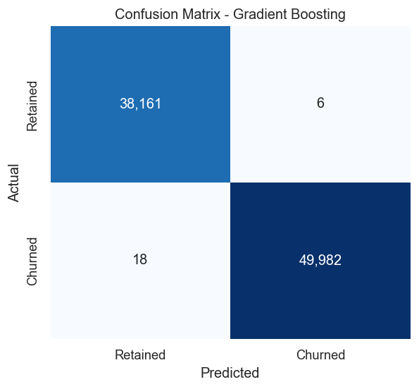
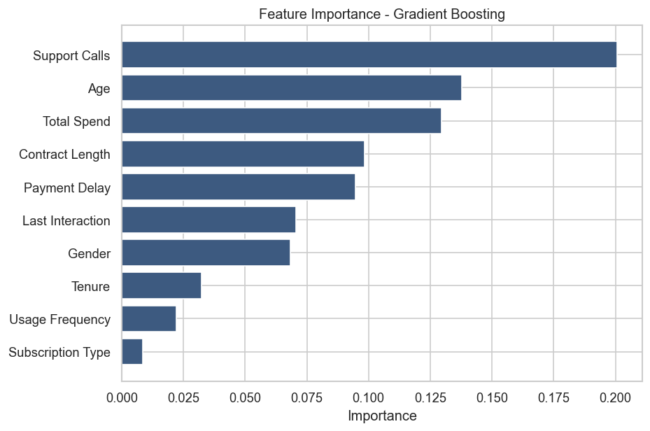
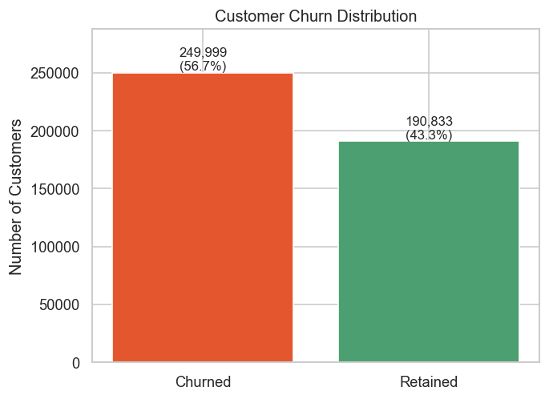
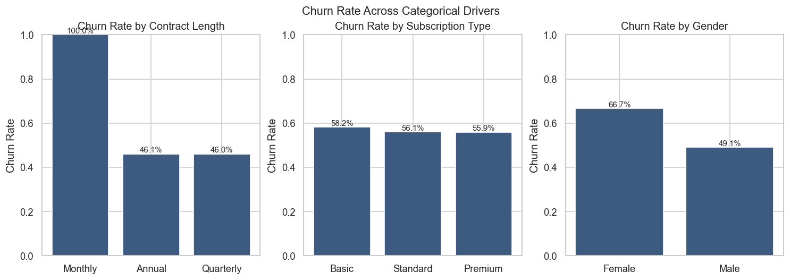
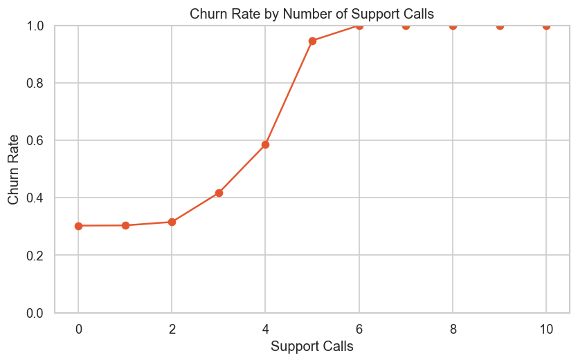
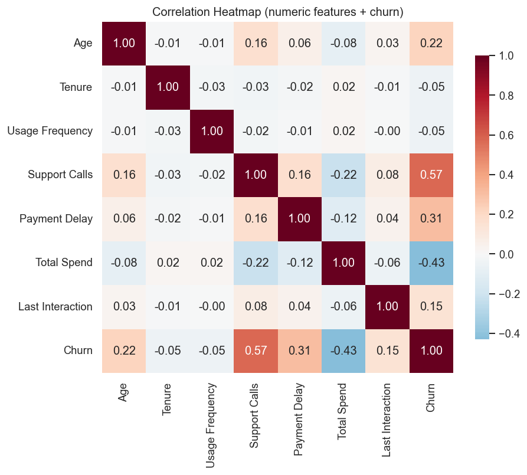
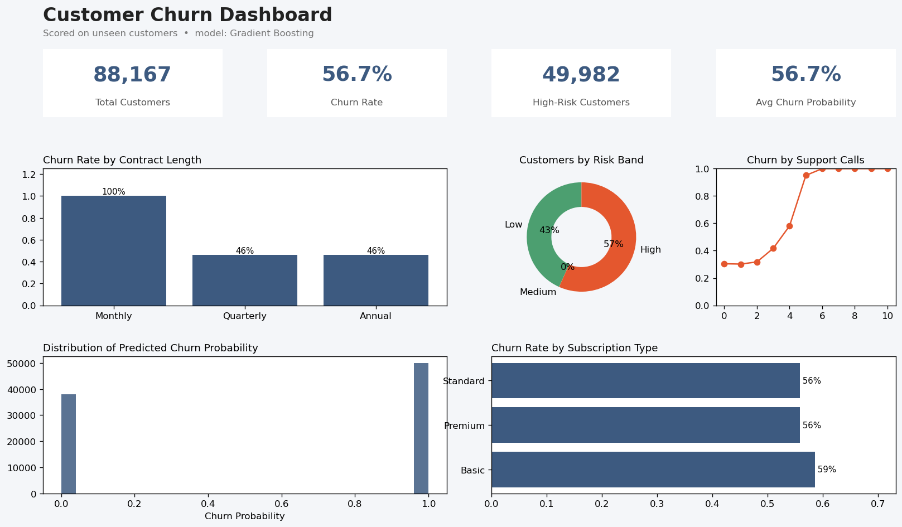

# Customer Churn Prediction


Predict which subscription customers are likely to **churn** (cancel their
service) using Python and machine learning, and surface the drivers of churn
through EDA visualizations and a Power BI dashboard.



---

## 📌 Problem Statement

Acquiring a new customer costs far more than retaining an existing one, so
predicting churn **before it happens** lets a business step in with targeted
retention offers. Given a customer's profile and behaviour (tenure, usage,
support calls, payment delays, contract type, spend, etc.), the goal is to:

1. **Predict** whether the customer will churn (binary classification).
2. **Explain** which factors drive churn, so the business can act on them.
3. **Deliver** the results in an interactive Power BI dashboard for stakeholders.

---

## 📊 Dataset

- **Source:** [Customer Churn Dataset — Kaggle (Muhammad Shahid Azeem)](https://www.kaggle.com/datasets/muhammadshahidazeem/customer-churn-dataset)
- **Files:** `customer_churn_dataset-training-master.csv` (~440K rows) and
  `customer_churn_dataset-testing-master.csv` (~64K rows), stored in [`data/`](data/).

| Column | Description |
|--------|-------------|
| `CustomerID` | Unique identifier (dropped for modelling) |
| `Age` | Customer age |
| `Gender` | Male / Female |
| `Tenure` | Months as a customer |
| `Usage Frequency` | How often the service is used |
| `Support Calls` | Number of support calls made |
| `Payment Delay` | Days of payment delay |
| `Subscription Type` | Basic / Standard / Premium |
| `Contract Length` | Monthly / Quarterly / Annual |
| `Total Spend` | Total amount spent |
| `Last Interaction` | Days since last interaction |
| `Churn` | **Target** — 1 = churned, 0 = retained |

### ⚠️ A note on the two data files (important)

The training and testing files **do not share the same distribution**. Inside
the *training* file the labels are near-deterministic (e.g. `Age > 50` or a
`Monthly` contract ⇒ ~100% churn); in the *testing* file those same conditions
churn only ~50–60% of the time. Using the testing file as a hold-out set
therefore measures **data drift**, not model quality, and makes every model look
broken (accuracy collapses to ~0.50 despite a healthy AUC).

This project handles it correctly:

- **Model evaluation** uses a stratified 80/20 split of the *training* file
  (honest, in-distribution).
- The provided *testing* file is scored only as a **data-drift demonstration**
  (the pipeline prints its accuracy) and is **not** used for headline metrics or
  the dashboard.

---

## 🗂️ Project Structure

```
customer-churn-prediction/
├── data/                       # raw CSVs + scored powerbi_churn_ready.csv
├── src/
│   ├── data_preprocessing.py   # load, clean, split, preprocessing pipeline
│   ├── train_model.py          # train & compare 3 models, save the best
│   ├── visualize.py            # EDA + evaluation charts -> images/
│   └── dashboard_mockup.py     # renders the Power BI mockup PNG
├── notebooks/
│   └── churn_analysis.ipynb    # narrative end-to-end walkthrough
├── models/                     # best_model.pkl + eval_artifacts.pkl
├── images/                     # all charts + dashboard screenshot
├── reports/                    # model_metrics.csv
├── powerbi/                    # PBIP scaffold + POWERBI_GUIDE.md
├── requirements.txt
├── LICENSE
└── README.md
```

---

## 🚀 Getting Started

```bash
# 1. (optional) create a virtual environment
python -m venv .venv
# Windows:  .venv\Scripts\activate    |    macOS/Linux:  source .venv/bin/activate

# 2. install dependencies
pip install -r requirements.txt

# 3. train models + export artifacts (writes models/, reports/, powerbi CSV)
python src/train_model.py

# 4. generate all charts
python src/visualize.py

# 5. (optional) render the Power BI dashboard mockup
python src/dashboard_mockup.py
```

Prefer notebooks? Open [`notebooks/churn_analysis.ipynb`](notebooks/churn_analysis.ipynb)
for the full narrated analysis.

---

## 🔬 Approach

1. **Preprocessing** ([`src/data_preprocessing.py`](src/data_preprocessing.py))
   — drop `CustomerID`, remove the single empty row, one-hot encode categoricals
   (`Gender`, `Subscription Type`, `Contract Length`), and standard-scale
   numerics. Everything is wrapped in a scikit-learn `Pipeline` so transforms are
   fit on the training fold only (no leakage).
2. **Modelling** ([`src/train_model.py`](src/train_model.py)) — train and compare
   three classifiers, then select the best by ROC-AUC:
   - Logistic Regression (interpretable baseline)
   - Random Forest
   - Gradient Boosting (`HistGradientBoostingClassifier`)
3. **Evaluation** — accuracy, precision, recall, F1, ROC-AUC on the held-out
   validation split, plus confusion matrix, ROC curves and feature importance.

---

## 📈 Results

Metrics on the held-out validation split (see [`reports/model_metrics.csv`](reports/model_metrics.csv)):

| Model | Accuracy | Precision | Recall | F1 | ROC-AUC |
|-------|:--------:|:---------:|:------:|:--:|:-------:|
| **Gradient Boosting** 🏆 | **0.9997** | **0.9999** | **0.9996** | **0.9998** | **1.000** |
| Random Forest | 0.9989 | 0.9999 | 0.9982 | 0.9991 | 1.000 |
| Logistic Regression | 0.8934 | 0.9234 | 0.8854 | 0.9040 | 0.959 |

The tree-based models capture the dataset's rule-like structure almost
perfectly; Logistic Regression is a strong, interpretable baseline.

<p align="center">
  
  
</p>

### Top churn drivers



**Support Calls**, **Age** and **Total Spend** are the strongest predictors of
churn.

---

## 🔎 Exploratory Data Analysis

| | |
|---|---|
|  |  |
|  |  |

Key findings:

- **Monthly** contracts churn dramatically more than Annual/Quarterly.
- Churn rises sharply once a customer makes **5+ support calls**.
- Higher **payment delay** and lower **total spend / tenure** associate with churn.

---

## 📊 Power BI Dashboard

An interactive dashboard summarises churn KPIs and drivers for stakeholders.
Build steps, DAX measures and the PBIP scaffold are in
[`powerbi/POWERBI_GUIDE.md`](powerbi/POWERBI_GUIDE.md).



> **Note:** the image above (`images/powerbi_dashboard.png`) is currently the
> data-driven **mockup** of the intended layout. After you build the report in
> Power BI Desktop (see the [guide](powerbi/POWERBI_GUIDE.md)), simply overwrite
> `images/powerbi_dashboard.png` with your real screenshot — no README edits
> needed.

Dashboard includes: KPI cards (total customers, churn rate, high-risk customers,
avg churn probability), churn by contract length, risk-band breakdown, churn by
support calls, churn-probability distribution, and churn by subscription type.

---

## 🧰 Tech Stack

**Python** · **pandas** · **scikit-learn** · **matplotlib** · **seaborn** ·
**Jupyter** · **Power BI**

---

## 📄 License

Released under the [MIT License](LICENSE).
